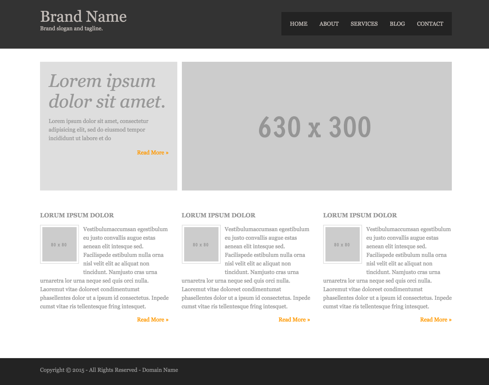

# Website Homework

Create the website from the screenshot bellow, giving the following
constraints:

* The site must use a `reset` or `normalize` stylesheet.
* The `box-sizing` should be set to `border-box` for all elements.
* The layout should be done with floats.
* The markup should use `semantic` HTML5
* The code should use proper indentation

## Note:

Be prepared to review and defend your work on Monday. We plan to assess each site individually and expect you to describe your code, defend your decisions, and articulate why you choose to do things a certain way.

